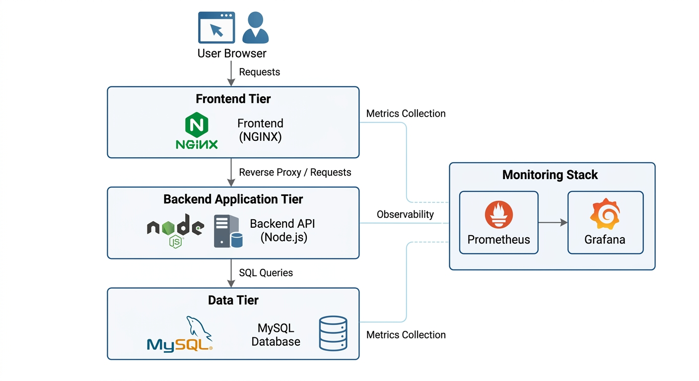
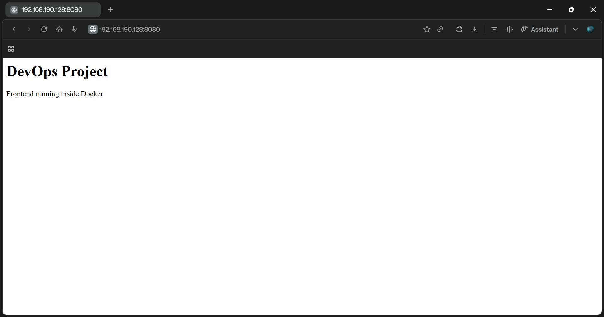
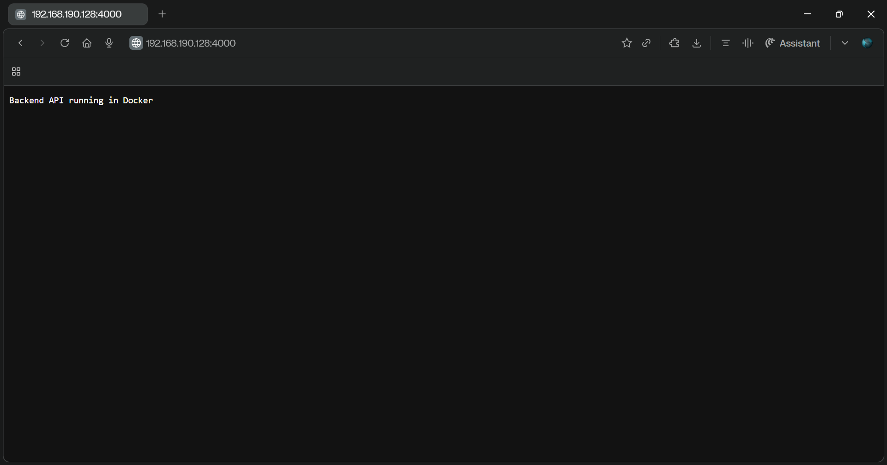
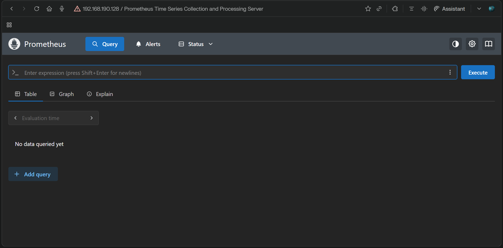
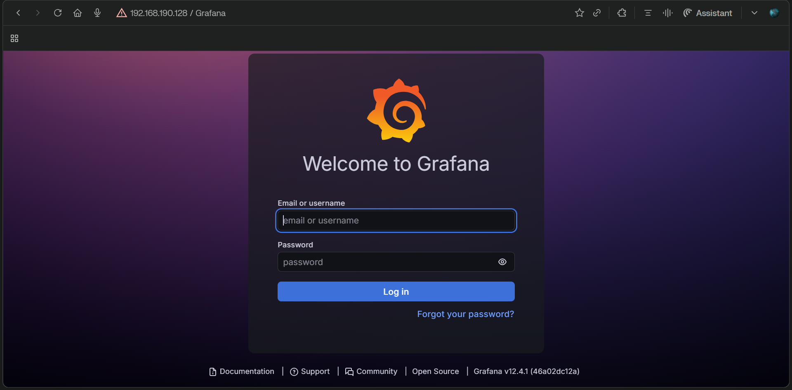

# DevOps Docker Microservices Project

## Overview

This project demonstrates a DevOps microservices architecture using Docker and Docker Compose.

The system includes multiple services running in containers:

- Frontend (NGINX)
- Backend API (Node.js)
- MySQL Database
- Monitoring stack (Prometheus and Grafana)
- CI/CD Pipeline (GitHub Actions)

The goal is to practice containerization, service orchestration, monitoring, and automation in a microservices environment.

---

## Architecture

User requests go through the frontend service, which communicates with the backend API and database. Monitoring tools collect metrics from all services.
```
User
 |
 v
Frontend (NGINX) :8080
 |
 v
Backend API (Node.js) :4000
 |
 v
MySQL Database :3306

Monitoring
 ├── Prometheus :9090
 └── Grafana :3001
```

---

## Architecture Diagram



---

## Tech Stack

| Tool | Purpose |
|---|---|
| Docker | Containerization |
| Docker Compose | Multi-container orchestration |
| NGINX | Frontend / Reverse Proxy |
| Node.js | Backend API |
| MySQL | Database |
| Prometheus | Metrics collection |
| Grafana | Monitoring dashboard |
| GitHub Actions | CI/CD pipeline |

---

## Project Structure
```
devops-docker-microservices-project
│
├── .github/workflows
│   └── docker-ci.yml
│
├── frontend
│   ├── Dockerfile
│   └── index.html
│
├── backend
│   ├── Dockerfile
│   └── server.js
│
├── docker-compose.yml
├── README.md
└── screenshots
```

---

## Services and Ports

| Service | Port |
|---|---|
| Frontend | 8080 |
| Backend API | 4000 |
| MySQL | 3306 |
| Prometheus | 9090 |
| Grafana | 3001 |

---

## Prerequisites

- Docker
- Docker Compose
- Git

---

## Run the Project

Start all services:
```bash
git clone https://github.com/Ilyasshimi/devops-docker-microservices-project.git
cd devops-docker-microservices-project
docker-compose up -d
```

Check running containers:
```bash
docker ps
```

Stop the services:
```bash
docker-compose down
```

---

## Access the Services

| Service | URL |
|---|---|
| Frontend | http://localhost:8080 |
| Backend API | http://localhost:4000 |
| Prometheus | http://localhost:9090 |
| Grafana | http://localhost:3001 |

Default Grafana login:
```
username: admin
password: admin
```

---

## CI/CD Pipeline

This project includes an automated CI/CD pipeline using GitHub Actions.

Pipeline file: `.github/workflows/docker-ci.yml`

On every `git push`, the pipeline automatically:

1. Checks out the code
2. Builds the frontend Docker image
3. Builds the backend Docker image
4. Verifies the build was successful

---

## Screenshots

### Running Containers


### Frontend Service


### Backend API


### Prometheus Monitoring


### Grafana Dashboard


---

## What I Learned

- How to build Docker images using Dockerfile
- How to run multi-container applications with Docker Compose
- How to design a microservices architecture
- How to monitor containerized services with Prometheus and Grafana
- How to automate CI/CD pipelines with GitHub Actions

---

## Future Improvements

- Deploy to a cloud platform (AWS EC2)
- Push Docker images to Docker Hub automatically
- Improve Grafana monitoring dashboards

---

## Author

**Ilyass Himi**  
DevOps learning project — 2025
